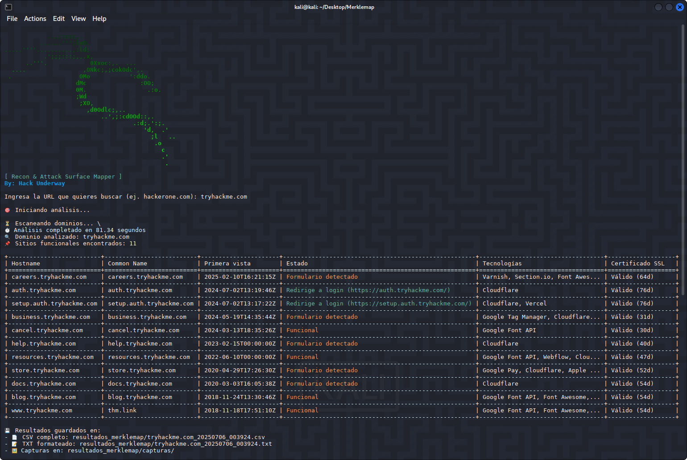

<h1 align="center">Merklemap 🐉</h1>

<p align="center">
  Herramienta de reconocimiento y mapeo de superficie de ataque mediante la API de Merklemap.
</p>

<p align="center">
  
</p>

<p align="center">
  
  
  
</p>

---

## 🚀 Características

- Descubre subdominios asociados a un dominio principal
- Detecta tecnologías web utilizadas (Wappalyzer)
- Verifica certificados SSL y su fecha de expiración
- Identifica formularios de login y páginas de autenticación
- Captura pantallas automáticas de páginas interesantes
- Genera reportes en CSV y TXT con los resultados
- Interfaz intuitiva con visualización en tabla
- Banner de presentación con estilo único

## 📌 Requisitos

- Python 3.12+

- Librerías: `requests`, `colorama`, `beautifulsoup4`, `python-Wappalyzer`, `pyppeteer`, `chromedriver-autoinstaller`, `selenium`, `tabulate`, `urllib3`, `pyOpenSSL`

## 🔧 Requisitos adicionales

- **Chrome/Chromium**: Necesario para las capturas de pantalla

# En sistemas Debian/Ubuntu:
```bash
sudo apt install chromium
```

## ⚠️ Advertencia

#### Esta herramienta solo debe usarse para:

- Auditorías de seguridad autorizadas
- Pruebas de penetración con permiso
- Investigación de seguridad defensiva
- Propósitos educativos

###### No utilices esta herramienta para actividades ilegales o sin el consentimiento del propietario del dominio.

---
## ⚙️ Instalación

Clona el repositorio:

```bash
git clone https://github.com/HackUnderway/Merklemap.git
```
```bash
cd Merklemap
```
```bash
pip install -r requirements.txt
```

## 🐍 Uso básico en Python
##### Ejecuta el script:

python3 merklemap.py

##### Ingresa el dominio que deseas analizar (ejemplo: example.com)


## 🐳 Uso con Docker

Merklemap incluye un Dockerfile que configura automáticamente el contenedor con Python y todas las dependencias necesarias.
Esto te permite usar la herramienta **sin instalar nada en tu sistema host.**

###### 🏗️ Construir la imagen:
*Dentro del repositorio:*

```bash
sudo docker build -t merklemap .
```
```bash
sudo docker run -it --rm -v $(pwd)/resultados_merklemap:/app/resultados_merklemap merklemap
```

📌 **Nota:** Dentro del contenedor Docker ya viene:

- Python 3.12

- Todas las librerías necesarias (requests, selenium, etc.)

- Configuración lista para ejecutar merklemap.py

#### Así puedes elegir entre:
✔ Usarlo en Python directamente

✔ O ejecutar el contenedor Docker con todo preconfigurado

#### La herramienta:

1 - Consultará la API de Merklemap

2 - Filtrará los subdominios legítimos

3 - Analizará cada uno detectando tecnologías

4 - Verificará certificados SSL

5 - Capturará pantallas de páginas de login

6 - Generará reportes detallados


> **El proyecto está abierto a colaboradores.**

# DISTRIBUCIONES SOPORTADAS
|Distribución | Versión verificada | 	¿Soportado? | 	Estado |
|--------------|--------------------|------|-------|
|Kali Linux| 2025.2| si| funcionando   |
|Parrot Security OS| 6.3| si | funcionando   |
|Windows| 11 | si | funcionando   |
|BackBox| 9 | si | funcionando   |
|Arch Linux| 2024.12.01 | si | funcionando   |

# SOPORTE
Preguntas, errores o sugerencias: info@hackunderway.com

# LICENSE
- [x] Merklemap tiene licencia.
- [x] Consulta el archivo [LICENSE](https://github.com/HackUnderway/Merklemap#MIT-1-ov-file) para más información.

# CYBERSECURITY RESEARCHER

* [Victor Bancayan](https://www.offsec.com/bug-bounty-program/) - (**CEO at [Hack Underway](https://hackunderway.com/)**) 

## 🔗 ENLACES
[](https://www.patreon.com/c/HackUnderway)
[](https://hackunderway.com)
[](https://www.facebook.com/HackUnderway)
[](https://www.youtube.com/@JeyZetaOficial)
[](https://x.com/JeyZetaOficial)
[](https://instagram.com/hackunderway)
[](https://tryhackme.com/p/JeyZeta)

## ☕️ Apoya el proyecto

Si te gusta esta herramienta, considera invitarme un café:

[](https://www.buymeacoffee.com/hackunderway)

## 🌞 Suscripciones

###### Suscríbete: [Jey Zeta](https://www.facebook.com/JeyZetaOficial/subscribe/)

[](https://www.kali.org/)

from  made in  with  by: <font color="red">Victor Bancayan</font>

© 2025
